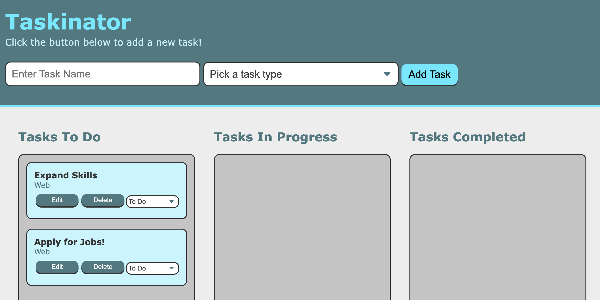

# Taskinator
This app is viewable at <https://cbarber1984.github.io/taskinator/>
> NOTE: This app is under active development

## Purpose
- Strengthen my understanding of JavaScript concepts
- Begin building my understanding of how Javascript is used to interact with the DOM

## What I Learned
- Methods for manipulating DOM elements based upon user input
- Using `eventListener` and `getElementbyId`
- Dynamically creating and styling DOM elements
- How to use `querySelector` to interact with the DOM
- Benefit of incorporating incremental `console.log` checks
- How to use the `selectedIndex` attribute to set dropdown values on page load

## Further Development Ideas
- Store task data on a server
- Incorporate user accounts to enable multiple users to store task lists
- Ability to assign tasks to other users
- Notifications when tasks arrive in completed list

